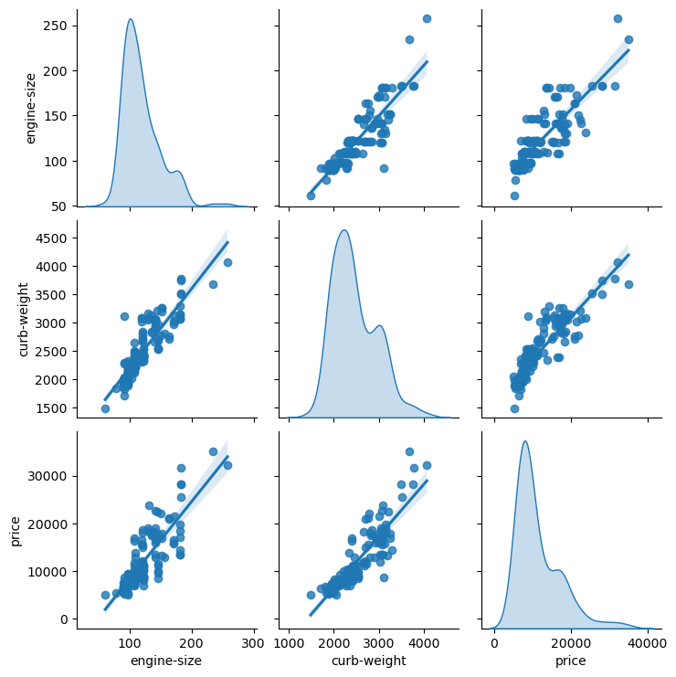

# Automobile_data_analysis
In this project, I applied various data analysis techniques to an automobile dataset. 

The methods employed include:

 ### Multivariate Visualization:
  * Created a pairplot using Seaborn to visualize the relationship and distribution amoung three numerical variables in the data set.
  * Customized the pairplot to include histograms,KDE plots and regression lines.

   

 ### Advanced Correlation Analysis:
   * Calculated spearman rank correlation coefficient for all numerical columns in the dataset.
   * Created heatmap to visualize the spearmans correlation matrix and compared it with pearson correlation matrix.

   

 ### Hypothesis testing - Two variables:
   * Performed a two sample t-test to determine if there is a significant difference in the means of two numerical variables across different categories and interpretted the result.

 ### Time series decomposition:
   * Created a time series dataset and decomposed the time series into trend,sesonal and residual components.
   * Using sesonal_decompose from stats models visualized each component using matplotlib.

   

### Multivariate Hypothesis testing:
   * Performed a MANOVA to test if there are significant difference in the means of multiplle dependent variables across different groups.
   * Used pingouin to conduct the analysis and interpreted the results.

### Complex pattern Identification:
   * Used PCA to reduce dimensionality of this high dimensional dataset. 
   * Visualized the first two principle components using a scatter plot then interpreted the variance explained by each component.

   

### Hypothesis testing - Paired variables:
   * Performed a paired t-test to compare the means of two related numerical variables before and after of an intervension.
   * Visualized the distribution of differences using a violin plot and reported the test statistics. 

   

### Advanced regression analysis:
   * Used a multiple linear regression model using stats models to predict a target variable based on several predictors.
   * Evaluated the model's performance using the adjusted R-squared and residual plots.

   

   

### Cluster analysis and visualization:
   * Used KMeans clustering to group the data into clusters based on multiple numerical features.
   * Visualized the clusters using scatter plot with cluster cetroids and interpreted the cluster characteristics.

   

### Anomaly Detection:
   * Implemented an anomaly detection algorithm using Isolation Forest method from scikit-learn.
   * Visualized the anomalies detected in a scatter plot and analysed their distribution within the dataset.
   
   

   